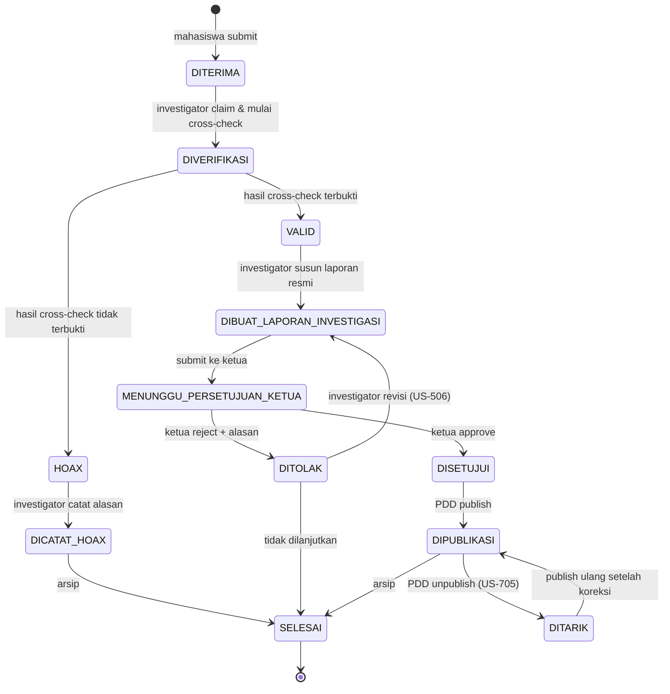

# PRD — Sistem Pelaporan Pelanggaran PEMIRA IKM UI 2025

| | |
|---|---|
| **Versi** | 1.0 |
| **Tanggal** | 10 Juli 2026 |
| **Status** | Draft untuk review |
| **Owner** | Komisi Pemilihan (KP) IKM UI |
| **Dokumen terkait** | [ERD](02-ERD.md) · [Arsitektur](../ARSITEKTUR-PEMIRA.md) · [Task Breakdown](04-TASK-BREAKDOWN.md) |

---

## 1. Latar Belakang & Masalah

Selama PEMIRA berlangsung, laporan pelanggaran kampanye masuk lewat jalur informal: DM Instagram, WhatsApp panitia, atau lisan. Akibatnya:

1. **Tidak ada jejak audit.** Kalau ada sengketa atau somasi, KP tidak punya bukti kapan laporan masuk, siapa yang memverifikasi, dan atas dasar apa keputusan diambil.
2. **Pelapor tidak tahu progres.** Laporan masuk lalu hilang. Ini menurunkan kepercayaan mahasiswa terhadap KP.
3. **Bukti mudah disangkal.** Screenshot yang dikirim lewat chat bisa diklaim sudah diedit karena tidak ada checksum/timestamp yang bisa diverifikasi.
4. **Alur persetujuan tidak tegas.** Tidak jelas siapa yang berwenang memutuskan sebuah laporan valid, dan siapa yang berhak mempublikasikannya.
5. **Publikasi tidak konsisten.** Hasil sidang kadang diumumkan di IG, kadang tidak sama sekali.

## 2. Tujuan Produk

Membangun kanal resmi tunggal (single source of truth) untuk **pelaporan → investigasi → persetujuan → publikasi** pelanggaran PEMIRA, dengan jejak audit yang tidak bisa dimanipulasi.

### 2.1 Goals

| # | Goal | Metrik Keberhasilan |
|---|---|---|
| G1 | Semua laporan pelanggaran masuk lewat satu kanal | ≥ 90% laporan tercatat di sistem (bukan DM/WA) |
| G2 | Pelapor bisa melacak status laporannya sendiri | 100% laporan punya kode tiket + halaman tracking |
| G3 | Setiap perubahan status tercatat & tidak bisa dihapus | 100% transisi status tersimpan di `report_status_history` |
| G4 | Bukti tidak bisa diutak-atik setelah submit | 100% file bukti punya checksum SHA-256 tersimpan |
| G5 | Waktu respons investigasi terukur | Median waktu DITERIMA → VALID/HOAX ≤ 3×24 jam |
| G6 | Publikasi hasil transparan | Semua laporan DISETUJUI terbit di halaman Transparansi ≤ 24 jam setelah approval |

### 2.2 Non-Goals (eksplisit TIDAK dikerjakan di v1)

- ❌ **Bukan sistem e-voting.** Aplikasi ini tidak menghitung suara.
- ❌ Tidak ada modul banding/appeal oleh terlapor (dipertimbangkan untuk v2).
- ❌ Tidak ada auto-posting ke Instagram lewat Graph API — PDD posting manual, sistem hanya menyimpan URL post-nya.
- ❌ Tidak ada mobile app native. Web responsive saja.
- ❌ Tidak ada chat/diskusi real-time antar role.
- ❌ Tidak ada integrasi SSO UI di v1 (pakai OTP email kampus). SSO ditaruh di v2.

---

## 3. Persona & Aktor

| Persona | Role sistem | Kebutuhan utama | Frekuensi pakai |
|---|---|---|---|
| **Rani, mahasiswa FISIP** | `MAHASISWA` | Lapor pelanggaran tanpa ribet daftar akun; ingin tahu laporannya ditindaklanjuti | 1–2× per periode |
| **Bagas, staf Divisi Hukum & Sekretariat** | `HUKUM_SEKRETARIAT` | Lihat antrean laporan, cross-check bukti, tandai VALID/HOAX, tulis laporan investigasi | Harian, saat masa kampanye |
| **Dimas, Ketua KP** | `KETUA_KP` | Baca laporan investigasi ringkas, approve/reject dengan alasan tertulis | 2–3× seminggu |
| **Sinta, staf PDD** | `PDD` | Ambil materi laporan yang disetujui, susun caption + banner, publikasikan | Setelah tiap approval |
| **Admin sistem** | `ADMIN` | Kelola user & role, kelola data kandidat, kelola tata tertib | Setup awal + insidental |
| **Publik / mahasiswa umum** | — (tanpa login) | Baca profil kandidat, aturan main, dan hasil publikasi pelanggaran | Bebas |

---

## 4. Ruang Lingkup Fungsional

### 4.1 Epic Map

```
EPIC-01  Fondasi & Infrastruktur
EPIC-02  Autentikasi & Otorisasi (RBAC)
EPIC-03  Manajemen User & Kandidat (Admin)
EPIC-04  Pelaporan oleh Mahasiswa
EPIC-05  Investigasi (Hukum & Sekretariat)
EPIC-06  Persetujuan (Ketua KP)
EPIC-07  Publikasi (PDD)
EPIC-08  Halaman Publik & Transparansi
EPIC-09  Notifikasi & Audit Trail
EPIC-10  Hardening, QA & Deployment
```

### 4.2 User Story per Epic

Format: `Sebagai <role>, saya ingin <aksi>, sehingga <manfaat>.`
Prioritas: **P0** = wajib rilis, **P1** = sangat diinginkan, **P2** = nice-to-have.

#### EPIC-02 — Autentikasi & Otorisasi

| ID | Story | Prio | Acceptance Criteria |
|---|---|---|---|
| US-201 | Sebagai mahasiswa, saya ingin verifikasi lewat OTP ke email kampus, sehingga bisa lapor tanpa bikin password | P0 | Given email berakhiran `@ui.ac.id`, when minta OTP, then kode 6 digit terkirim & berlaku 10 menit; salah 5× → blokir 15 menit |
| US-202 | Sebagai staf KP, saya ingin login dengan email + password, sehingga bisa akses dashboard | P0 | Password di-hash BCrypt cost ≥ 10; salah 5× → akun terkunci 15 menit |
| US-203 | Sebagai user login, saya ingin sesi saya diperpanjang otomatis, sehingga tidak perlu login ulang tiap 15 menit | P0 | Access token 15 menit; refresh token 7 hari di httpOnly cookie; rotasi refresh token tiap pakai |
| US-204 | Sebagai user, saya ingin logout, sehingga sesi saya benar-benar mati | P0 | Refresh token di-revoke di DB; cookie di-clear; token lama ditolak |
| US-205 | Sebagai sistem, saya ingin menolak akses lintas role | P0 | `MAHASISWA` akses `/api/investigations` → 403; dites di integration test |

#### EPIC-04 — Pelaporan oleh Mahasiswa

| ID | Story | Prio | Acceptance Criteria |
|---|---|---|---|
| US-401 | Sebagai mahasiswa, saya ingin mengisi form laporan pelanggaran | P0 | Field wajib: kategori, tanggal kejadian, lokasi, kronologi (min 50 char). Opsional: kandidat terlapor, bukti |
| US-402 | Sebagai mahasiswa, saya ingin unggah bukti (foto/video/dokumen) | P0 | Maks 5 file, tiap file ≤ 10 MB, tipe: jpg/png/webp/mp4/pdf. Checksum SHA-256 dihitung server-side & disimpan |
| US-403 | Sebagai mahasiswa, saya ingin dapat kode tiket setelah submit | P0 | Format `PMR-2025-XXXXX`, ditampilkan di layar + dikirim ke email |
| US-404 | Sebagai mahasiswa, saya ingin melacak status laporan pakai kode tiket | P0 | Halaman `/status` — input kode tiket + NPM → tampil timeline status (tanpa membuka isi investigasi internal) |
| US-405 | Sebagai mahasiswa, saya ingin melapor secara anonim | P1 | Identitas disembunyikan dari UI investigator, tapi tetap tersimpan terenkripsi untuk kebutuhan hukum |
| US-406 | Sebagai sistem, saya ingin membatasi spam laporan | P0 | Maks 3 laporan / NPM / 24 jam. Kelebihan → HTTP 429 |

#### EPIC-05 — Investigasi

| ID | Story | Prio | Acceptance Criteria |
|---|---|---|---|
| US-501 | Sebagai Hukum&Sekretariat, saya ingin melihat antrean laporan masuk | P0 | Tabel: filter status/kategori/tanggal, sort, pagination 20/hal |
| US-502 | Sebagai Hukum&Sekretariat, saya ingin mengambil (claim) laporan agar tidak dobel kerja | P1 | Satu laporan hanya bisa di-claim satu investigator; ditampilkan di kolom "Ditangani oleh" |
| US-503 | Sebagai Hukum&Sekretariat, saya ingin melihat detail + bukti laporan | P0 | Preview gambar/video inline, unduh dokumen, tampilkan checksum |
| US-504 | Sebagai Hukum&Sekretariat, saya ingin menetapkan hasil cross-check VALID atau HOAX | P0 | Wajib isi catatan temuan ≥ 50 char. Status berubah + tercatat di history |
| US-505 | Sebagai Hukum&Sekretariat, saya ingin menyusun laporan investigasi resmi untuk Ketua | P0 | Hanya untuk laporan berstatus VALID. Isi: temuan, pasal dilanggar, rekomendasi sanksi. Submit → status `MENUNGGU_PERSETUJUAN_KETUA` |
| US-506 | Sebagai Hukum&Sekretariat, saya ingin merevisi laporan investigasi yang ditolak Ketua | P1 | Laporan `DITOLAK` bisa direvisi & diajukan ulang, versi lama tetap tersimpan |

#### EPIC-06 — Persetujuan

| ID | Story | Prio | Acceptance Criteria |
|---|---|---|---|
| US-601 | Sebagai Ketua KP, saya ingin melihat daftar laporan investigasi yang menunggu keputusan | P0 | Urut terlama dulu; badge jumlah pending di sidebar |
| US-602 | Sebagai Ketua KP, saya ingin menyetujui laporan investigasi | P0 | Status → `DISETUJUI`; PDD dinotifikasi; tercatat siapa & kapan |
| US-603 | Sebagai Ketua KP, saya ingin menolak dengan alasan tertulis | P0 | Alasan wajib ≥ 30 char; status → `DITOLAK`; investigator dinotifikasi |
| US-604 | Sebagai Ketua KP, saya ingin melihat riwayat keputusan saya | P2 | Halaman arsip keputusan, filter tanggal |

#### EPIC-07 — Publikasi

| ID | Story | Prio | Acceptance Criteria |
|---|---|---|---|
| US-701 | Sebagai PDD, saya ingin melihat daftar laporan siap publish | P0 | Hanya menampilkan yang berstatus `DISETUJUI` |
| US-702 | Sebagai PDD, saya ingin menyusun draft publikasi (judul, ringkasan, isi, banner) | P0 | Bisa disimpan sebagai DRAFT dan diedit ulang |
| US-703 | Sebagai PDD, saya ingin mempublikasikan draft | P0 | Status laporan → `DIPUBLIKASI`; muncul di halaman publik `/publikasi`; `published_at` terisi |
| US-704 | Sebagai PDD, saya ingin menautkan URL post Instagram | P1 | Field opsional `instagram_url`, divalidasi format URL |
| US-705 | Sebagai PDD, saya ingin menarik publikasi (unpublish) jika ada kekeliruan | P1 | Status → `DITARIK`, hilang dari publik, alasan wajib diisi |

#### EPIC-08 — Halaman Publik

| ID | Story | Prio | Acceptance Criteria |
|---|---|---|---|
| US-801 | Sebagai pengunjung, saya ingin melihat landing page + timeline PEMIRA | P0 | Hero navy+gold, LCP ≤ 2.5s di 4G |
| US-802 | Sebagai pengunjung, saya ingin melihat profil kandidat (visi, misi, proker) | P0 | Grid kartu kandidat BEM & BPM, halaman detail |
| US-803 | Sebagai pengunjung, saya ingin membaca tata tertib & dasar hukum | P0 | Halaman statis dari CMS/markdown, ada anchor per pasal |
| US-804 | Sebagai pengunjung, saya ingin melihat rekap publikasi pelanggaran | P0 | Feed kartu, filter kandidat & kategori, tautan ke IG |

#### EPIC-09 — Notifikasi & Audit

| ID | Story | Prio | Acceptance Criteria |
|---|---|---|---|
| US-901 | Sebagai staf KP, saya ingin dapat notifikasi in-app saat ada tugas baru | P0 | Bell icon + badge; realtime opsional (polling 60s cukup untuk v1) |
| US-902 | Sebagai pelapor, saya ingin dapat email saat status laporan berubah | P1 | Email dikirim async lewat queue; kegagalan kirim tidak mem-block transaksi |
| US-903 | Sebagai auditor, saya ingin melihat log lengkap semua aksi | P0 | Tabel `audit_logs` append-only; tidak ada endpoint DELETE |

### 4.3 State Machine Laporan (kontrak resmi)



**Aturan invarian (harus dites):**
1. Transisi di luar diagram di atas → `409 Conflict`, bukan 500.
2. Setiap transisi menulis 1 baris ke `report_status_history` dalam transaksi yang sama dengan update `reports.status`. Kalau salah satu gagal, keduanya rollback.
3. Hanya role pemilik tahap yang boleh memicu transisi (mis. hanya `KETUA_KP` yang bisa `MENUNGGU_PERSETUJUAN_KETUA → DISETUJUI`).
4. Status `SELESAI` bersifat terminal — tidak ada transisi keluar.

---

## 5. Requirement Non-Fungsional

| Kategori | Requirement | Target |
|---|---|---|
| **Performa** | p95 latency API baca | ≤ 300 ms |
| | p95 latency API tulis (tanpa upload) | ≤ 600 ms |
| | LCP halaman publik | ≤ 2.5 s (4G) |
| **Skala** | Concurrent user puncak (hari pencoblosan) | 500 |
| | Total laporan per periode | ~500 |
| **Ketersediaan** | Uptime masa kampanye | ≥ 99% |
| **Keamanan** | Password | BCrypt cost 12 |
| | Transport | HTTPS wajib, HSTS aktif |
| | Bukti | Checksum SHA-256, storage write-once, tidak ada endpoint delete file |
| | Rate limit | 3 laporan/NPM/hari; 100 req/menit/IP untuk API publik |
| | OWASP | Bebas dari OWASP Top 10 kategori A01, A02, A03, A05, A07 (diverifikasi manual + dependency scan) |
| **Privasi** | Identitas pelapor anonim | Terenkripsi at-rest (AES-256), hanya bisa dibuka Ketua KP + Admin dengan alasan tercatat di audit log |
| | Retensi data | 2 tahun setelah PEMIRA selesai, lalu anonimisasi |
| **Aksesibilitas** | Halaman publik | WCAG 2.1 AA — kontras ≥ 4.5:1, navigasi keyboard penuh |
| **Kompatibilitas** | Browser | 2 versi terakhir Chrome, Firefox, Safari, Edge |
| **Observability** | Log terstruktur (JSON), request-id di tiap response header | Wajib |
| **Bahasa** | Semua UI & pesan error | Bahasa Indonesia |

---

## 6. Asumsi, Dependensi, dan Risiko

### Asumsi
- Semua mahasiswa UI punya email `@ui.ac.id` yang aktif.
- KP menyediakan daftar staf beserta rolenya sebelum go-live (untuk seeding user).
- Tata tertib & daftar pasal pelanggaran sudah final sebelum development sprint 3.

### Dependensi Eksternal
| Dependensi | Dipakai untuk | Rencana kalau gagal |
|---|---|---|
| SMTP kampus / SendGrid | OTP + notifikasi email | Fallback ke tampilkan OTP di layar (mode dev), atau ganti provider |
| S3-compatible storage (atau Cloudinary) | Simpan bukti | Fallback simpan di volume server + backup harian |
| PostgreSQL managed | Database utama | Self-host di VPS + `pg_dump` harian |

### Risiko
| Risiko | Dampak | Mitigasi |
|---|---|---|
| Serangan spam/DDoS saat masa kampanye panas | Layanan down, laporan asli tenggelam | Rate limit per IP & per NPM, Cloudflare di depan, captcha di form lapor |
| Laporan fitnah/hoax masif ke satu kandidat | Reputasi kandidat rusak sebelum diverifikasi | Isi laporan TIDAK PERNAH publik sebelum status `DIPUBLIKASI` |
| Bukti diklaim palsu saat sengketa | Keputusan KP digugat | Checksum SHA-256 + timestamp server + audit log append-only |
| Investigator bocorkan identitas pelapor anonim | Pelapor terintimidasi | Enkripsi kolom identitas; akses buka identitas dicatat di audit log |
| Deadline mepet dengan jadwal PEMIRA | Fitur P0 tidak selesai | Scope P0 dikunci; P1/P2 boleh dipotong (lihat Task Breakdown) |

---

## 7. Rencana Rilis

| Rilis | Isi | Target |
|---|---|---|
| **M1 — Fondasi** | EPIC-01, EPIC-02 | Minggu 2 |
| **M2 — Alur Inti** | EPIC-04, EPIC-05, EPIC-06 | Minggu 5 |
| **M3 — Publikasi & Publik** | EPIC-07, EPIC-08, EPIC-03 | Minggu 7 |
| **M4 — Rilis Produksi** | EPIC-09, EPIC-10, UAT | Minggu 9 |

**Definition of Done (tingkat story):**
- [ ] Kode di-merge ke `main` lewat PR yang di-review ≥ 1 orang
- [ ] Unit test untuk business logic; coverage modul ≥ 70%
- [ ] Integration test untuk endpoint (happy path + minimal 1 error path)
- [ ] Acceptance criteria di story terpenuhi & didemokan
- [ ] Tidak ada error lint/format (Spotless, ESLint)
- [ ] Endpoint terdokumentasi di OpenAPI/Swagger
- [ ] Perubahan skema DB lewat migrasi Flyway (bukan `ddl-auto: update`)
