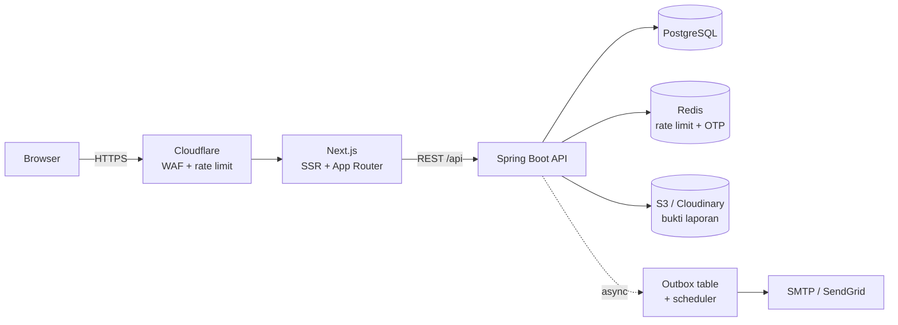

# Arsitektur — Keputusan, Kontrak API, dan Deployment

Dokumen ini **melengkapi** [`ARSITEKTUR-PEMIRA.md`](../ARSITEKTUR-PEMIRA.md) yang sudah membahas struktur folder, coding style, service pattern, dan design system. Di sini fokusnya: keputusan arsitektural beserta alasannya, kontrak API, dan rencana deployment.

> Sebelumnya: [ERD](02-ERD.md) · Selanjutnya: [Task Breakdown](04-TASK-BREAKDOWN.md)

---

## 1. Gambaran Sistem



**Kenapa monolith modular, bukan microservices?** Beban puncak 500 concurrent user dan ~500 laporan per periode. Microservices menambah biaya operasional (service discovery, distributed tracing, transaksi lintas service) tanpa menyelesaikan masalah apa pun yang kita punya. Package-by-feature di satu deployable sudah memberi batas modul yang jelas; kalau suatu saat benar-benar perlu dipecah, batasnya sudah tergambar.

---

## 2. Architecture Decision Records (ADR)

### ADR-001 — Transisi status dijaga di level database, bukan hanya di service
**Konteks.** Dua investigator bisa membuka laporan yang sama dan menekan "Tandai VALID" bersamaan.
**Keputusan.** Setiap `UPDATE reports SET status` menyertakan guard `WHERE status = :expectedFrom`. Kalau `rowsAffected == 0`, lempar `IllegalStateTransitionException` → HTTP 409.
**Konsekuensi.** Aman dari race tanpa perlu `SELECT ... FOR UPDATE` atau lock aplikasi. Service tetap wajib memvalidasi transisi lebih dulu supaya pesan error-nya ramah, tapi database yang jadi penjaga terakhir.

### ADR-002 — State machine dideklarasikan, bukan tersebar di if-else
**Keputusan.** Satu kelas `ReportStateMachine` memegang `Map<ReportStatus, Set<Transition>>` di mana `Transition = (toStatus, allowedRole)`. Semua service memanggil `stateMachine.assertCanTransition(from, to, actorRole)`.
**Alasan.** Diagram di PRD dan kode tidak boleh menyimpang. Satu tempat untuk diubah, satu tempat untuk dites — tabel transisi bisa diuji lengkap dengan parameterized test.

### ADR-003 — Access token di memori, refresh token di httpOnly cookie
**Keputusan.** Access token (15 menit) disimpan di Zustand store (hilang saat refresh halaman, lalu di-restore lewat `/auth/refresh`). Refresh token (7 hari) di cookie `httpOnly; Secure; SameSite=Strict`.
**Alasan.** Access token di `localStorage` bisa dicuri lewat XSS. Refresh token di cookie httpOnly tidak bisa dibaca JavaScript. Refresh token dirotasi tiap dipakai; kalau token lama dipakai ulang (indikasi pencurian), seluruh keluarga token milik user itu di-revoke.

### ADR-004 — Notifikasi email lewat pola Outbox, bukan panggilan langsung
**Konteks.** `submitReport()` berjalan dalam `@Transactional`. Kalau di dalamnya memanggil SMTP dan SMTP lambat/mati, transaksi database tertahan atau gagal — laporan mahasiswa hilang gara-gara email.
**Keputusan.** Simpan baris ke tabel `outbox_messages` dalam transaksi yang sama. `@Scheduled` poller mengirimnya di luar transaksi, dengan retry.
**Konsekuensi.** Submit laporan tidak pernah gagal karena masalah email. Butuh 1 tabel + 1 scheduler tambahan. (Redis/RabbitMQ berlebihan untuk skala ini.)

### ADR-005 — Rate limit di Redis, bukan di tabel Postgres
**Keputusan.** Bucket `ratelimit:report:{npm}` dengan TTL 24 jam. Counter IP `ratelimit:ip:{ip}` TTL 60 detik.
**Alasan.** Rate limit adalah data fana dan sering ditulis. Menulisnya ke Postgres berarti write amplification ke disk untuk data yang tidak perlu tahan lama.
**Fallback.** Kalau Redis mati, sistem *fail-open* untuk rate limit IP (biar layanan tetap hidup) tapi *fail-closed* untuk batas 3 laporan/hari — batas ini diverifikasi ulang lewat query `count(*)` ke Postgres sebagai jaring pengaman.

### ADR-006 — Identitas pelapor anonim dienkripsi kolom, bukan dihapus
**Keputusan.** `reporter_name_enc` dkk. dienkripsi AES-256-GCM dengan kunci dari env var (bukan di kode, bukan di DB). Dekripsi hanya lewat satu service `ReporterIdentityService`, yang menulis `audit_logs` setiap kali dipanggil.
**Alasan.** Kalau ada somasi, KP harus bisa membuktikan laporan datang dari mahasiswa nyata. Tapi investigator sehari-hari tidak boleh melihatnya.

### ADR-007 — Isi laporan tidak pernah publik sebelum `DIPUBLIKASI`
**Keputusan.** Endpoint publik hanya membaca tabel `publications`, tidak pernah `reports`. Halaman tracking (`/status`) hanya mengembalikan `ticket_code`, `status`, dan timeline tanggal — bukan `description`, bukan `findings`, bukan identitas kandidat terlapor.
**Alasan.** Ini mitigasi risiko terbesar di PRD: laporan fitnah yang bocor sebelum diverifikasi bisa menghancurkan kandidat, dan menjadikan aplikasi ini alat kampanye hitam.

### ADR-008 — Target Java 17 + Maven Wrapper, bukan Java 21 + Maven terpasang
**Konteks.** Mesin dev punya JDK 17 dan tidak punya Maven.
**Keputusan.** `pom.xml` menargetkan Java 17. Maven tidak di-install — `mvnw`/`mvnw.cmd` di-commit ke repo.
**Alasan.** Spring Boot 3.5 mendukung Java 17 sepenuhnya. Fitur Java 21 yang relevan (virtual threads) tidak dibutuhkan pada beban 500 concurrent user. Maven Wrapper mengunci versi Maven di repo, sehingga build di laptop dev, CI, dan Docker memakai versi yang sama persis.
**Konsekuensi.** Kalau nanti butuh virtual threads, naik ke JDK 21 hanya mengubah `<java.version>` — tidak ada API Java 21 yang terlanjur dipakai.

### ADR-009 — Tema Tailwind di CSS (`@theme`), bukan `tailwind.config.ts`
**Konteks.** `create-next-app` menghasilkan Next.js 16 + Tailwind v4. Tailwind v4 memindahkan konfigurasi tema dari JavaScript ke CSS.
**Keputusan.** Semua token warna & tipografi dideklarasikan di `app/globals.css` dalam blok `@theme`. Tidak ada `tailwind.config.ts`.
**Konsekuensi.** Contoh `tailwind.config.ts` di `ARSITEKTUR-PEMIRA.md` §7.1 sudah usang — token yang berlaku ada di `globals.css`. Lihat juga ADR-011 soal penamaan tokennya.

### ADR-010 — Role guard edge ada di `proxy.ts`, dan bukan otorisasi sebenarnya
**Konteks.** Next.js 16 mengganti nama `middleware.ts` menjadi `proxy.ts`. Dokumentasinya menyatakan tegas: proxy **bukan** solusi manajemen sesi atau otorisasi.
**Keputusan.** `proxy.ts` hanya melakukan *optimistic check* — membaca role dari token untuk mengalihkan user lebih awal agar UX enak. Otorisasi yang mengikat tetap di `@PreAuthorize` backend, dengan guard kedua di `layout.tsx` dashboard.
**Alasan.** Token di edge bisa kadaluarsa atau dipalsukan tanpa verifikasi penuh. Kalau proxy dijadikan satu-satunya penjaga, siapa pun yang bisa mengarang cookie bisa membuka dashboard Ketua KP. Backend yang memutuskan, frontend hanya mempercantik.

### ADR-011 — Token brand dipisah dari token semantik shadcn
**Konteks.** `shadcn init` menyuntikkan blok `@theme inline` yang mendefinisikan `--color-primary` dan `--color-accent` ke skala abu-abu netralnya. Karena blok itu muncul setelah `@theme` kita, `bg-primary` diam-diam berubah dari navy menjadi abu-abu — build tetap hijau, warnanya saja yang salah.
**Keputusan.** Dua lapis token yang namanya tidak bertabrakan:
- **Brand** (`--color-navy`, `--color-gold`, `--color-maroon`, `--color-ink*`, status) — nama warna harfiah, dipakai langsung di halaman publik: `bg-navy`, `text-gold`.
- **Semantik shadcn** (`--primary`, `--accent`, `--muted`, …) — nama peran, dipakai internal oleh komponen.

Jembatannya di `:root`: `--primary: var(--color-navy)`, `--ring: var(--color-gold)`, `--destructive: var(--color-danger)`.
**Alasan.** `--accent` milik shadcn berarti "warna hover netral", bukan aksen brand. Kalau ditimpa dengan emas, setiap hover state di seluruh aplikasi berubah jadi emas. Memisahkan nama membuat komponen shadcn tetap ikut brand (tombol primer jadi navy, focus ring jadi emas) tanpa merusak skala netralnya.
**Konsekuensi.** Di kode pakai `bg-navy`/`text-gold`, **bukan** `bg-primary`/`text-accent`.

### ADR-012 — Komponen shadcn kini berbasis Base UI: pakai `render`, bukan `asChild`
**Konteks.** shadcn versi terbaru membangun komponennya di atas `@base-ui/react`, bukan Radix.
**Keputusan.** Untuk merender komponen sebagai elemen lain (misal `Button` sebagai `Link`), pakai prop `render`: `<Button render={<Link href="/lapor" />}>Lapor</Button>`.
**Alasan.** `asChild` adalah API Radix dan tidak ada di Base UI. Contoh shadcn yang beredar di internet umumnya masih memakai `asChild` — itu akan gagal typecheck di proyek ini.
### ADR-013 — Identitas institusi: Komite Pengawasan KM Poltekkes Kemenkes Bandung
**Konteks.** Draft awal dokumen ini ditulis untuk "PEMIRA IKM UI". Logo resmi yang diberikan justru milik **Komite Pengawasan KM Poltekkes Kemenkes Bandung**, dan lingkup sebenarnya adalah badan pengawas calon **BEM & BPM**.
**Keputusan.** Seluruh dokumen dan kode diselaraskan ke Poltekkes Kemenkes Bandung:
- Package backend: `id.ikmui.pemira` → `id.kppoltekkesbdg.pemira`
- Domain email OTP: `@ui.ac.id` → `@poltekkesbandung.ac.id`
- Kolom `users.faculty` → `users.study_program` (Poltekkes memakai jurusan/prodi, bukan fakultas)
- Semua string identitas frontend diambil dari satu sumber: `lib/constant/site.ts`
- Akronim **KP** kini berarti **Komite Pengawasan**, bukan Komisi Pemilihan. Nama role `KETUA_KP` tetap.

**⚠️ Belum dikonfirmasi KP** — perlu divalidasi sebelum EPIC-02:
1. Domain email kampus yang benar (`poltekkesbandung.ac.id` masih asumsi). Ini memblokir validasi OTP di US-201.
2. Alamat email kontak resmi dan jam operasional yang tampil di footer.


### ADR-014 — Spring Boot 3.5.16, bukan 4.x meski itu default terbaru
**Konteks.** start.spring.io kini men-default ke **Spring Boot 4.1.0** (dengan Spring Framework 7, Spring Security 7, dan nama starter baru seperti `spring-boot-starter-webmvc` serta test starter yang dipecah-pecah).
**Keputusan.** Pin ke **3.5.16** (rilis 3.x terbaru).
**Alasan.** Seluruh pola kode di `ARSITEKTUR-PEMIRA.md` dan contoh di kontrak API ditulis untuk Spring Boot 3.x. Lompatan major ke 4 membawa perubahan pada Spring Security dan auto-config yang belum tentu cocok dengan pola itu, dan dokumentasi/contoh di ekosistem masih mayoritas 3.x. Untuk proyek dengan tenggat PEMIRA, prediktabilitas lebih berharga daripada memakai versi terbaru.
**Catatan teknis.** Versi artifact Maven adalah `3.5.16` — **tanpa** suffix `.RELEASE`. ID di metadata start.spring.io menampilkan `3.5.16.RELEASE`, tapi itu bukan koordinat Maven yang valid (build gagal resolve). Suffix `.RELEASE` sudah ditinggalkan sejak Spring Boot 2.x.
**Konsekuensi.** Kalau suatu saat naik ke 4.x, yang berubah terutama: nama starter, konfigurasi Spring Security (lambda DSL sudah dipakai, jadi relatif aman), dan beberapa default. Bukan pekerjaan sepele — jadwalkan terpisah, bukan disisipkan.

---

## 3. Kontrak API

Base path `/api/v1`. Semua response dibungkus `ApiResponse<T>`:
```json
{ "success": true, "message": "OK", "data": { }, "errors": null, "requestId": "01J..." }
```
Error validasi (400):
```json
{ "success": false, "message": "Validasi gagal", "data": null,
  "errors": [{ "field": "description", "message": "Kronologi minimal 50 karakter" }],
  "requestId": "01J..." }
```

### 3.1 Auth
| Method | Path | Role | Keterangan |
|---|---|---|---|
| POST | `/auth/otp/request` | publik | Body `{ email, npm }`. Selalu balas 200 walau email tak terdaftar (cegah user enumeration) |
| POST | `/auth/otp/verify` | publik | Body `{ email, code }` → access + refresh token |
| POST | `/auth/login` | publik | Staf KP: `{ email, password }` |
| POST | `/auth/refresh` | cookie | Rotasi refresh token |
| POST | `/auth/logout` | authenticated | Revoke refresh token |
| GET | `/auth/me` | authenticated | Profil + roles |

### 3.2 Laporan
| Method | Path | Role | Keterangan |
|---|---|---|---|
| POST | `/reports` | `MAHASISWA` | Submit. 429 bila melewati rate limit |
| POST | `/reports/{id}/evidences` | `MAHASISWA` (pemilik) | Multipart, maks 5 file. Hanya boleh saat status `DITERIMA` |
| GET | `/reports/track?ticket=&npm=` | publik | Timeline status saja (ADR-007) |
| GET | `/reports/mine` | `MAHASISWA` | Laporan milik sendiri |
| GET | `/reports` | `HUKUM_SEKRETARIAT` | Query: `status`, `category`, `from`, `to`, `page`, `size` |
| GET | `/reports/{id}` | `HUKUM_SEKRETARIAT`, `KETUA_KP` | Detail + bukti + history |
| POST | `/reports/{id}/claim` | `HUKUM_SEKRETARIAT` | `DITERIMA → DIVERIFIKASI`, set `assignee_id`. 409 bila sudah di-claim |

### 3.3 Investigasi
| Method | Path | Role | Keterangan |
|---|---|---|---|
| POST | `/investigations` | `HUKUM_SEKRETARIAT` | Body `{ reportId, verdict, crossCheckNote }` → status `VALID`/`HOAX` |
| PUT | `/investigations/{id}/report` | `HUKUM_SEKRETARIAT` | Isi laporan resmi (findings, ruleIds, recommendation) |
| POST | `/investigations/{id}/submit` | `HUKUM_SEKRETARIAT` | → `MENUNGGU_PERSETUJUAN_KETUA` |
| GET | `/investigations/{id}` | `HUKUM_SEKRETARIAT`, `KETUA_KP` | |
| GET | `/investigations?status=PENDING` | `KETUA_KP` | Antrean ketua |

### 3.4 Persetujuan
| Method | Path | Role | Keterangan |
|---|---|---|---|
| POST | `/investigations/{id}/approve` | `KETUA_KP` | → `DISETUJUI`, notifikasi PDD |
| POST | `/investigations/{id}/reject` | `KETUA_KP` | Body `{ reason }` (≥30 char) → `DITOLAK` |

### 3.5 Publikasi
| Method | Path | Role | Keterangan |
|---|---|---|---|
| GET | `/publications/ready` | `PDD` | Investigasi berstatus `DISETUJUI` belum punya publikasi |
| POST | `/publications` | `PDD` | Buat draft |
| PUT | `/publications/{id}` | `PDD` | Edit draft |
| POST | `/publications/{id}/publish` | `PDD` | → `DIPUBLIKASI` |
| POST | `/publications/{id}/withdraw` | `PDD` | Body `{ reason }` → `DITARIK` |
| GET | `/public/publications` | publik | Feed, paginated |
| GET | `/public/publications/{slug}` | publik | Detail |

### 3.6 Kandidat, Aturan, Admin
| Method | Path | Role |
|---|---|---|
| GET | `/public/candidates` | publik |
| GET | `/public/candidates/{id}` | publik |
| POST/PUT/DELETE | `/candidates`, `/candidates/{id}` | `ADMIN` |
| GET | `/public/rules` | publik |
| CRUD | `/users`, `/users/{id}/roles` | `ADMIN` |
| GET | `/audit-logs` | `ADMIN`, `KETUA_KP` |

### 3.7 Notifikasi
| Method | Path | Role |
|---|---|---|
| GET | `/notifications?unread=true` | authenticated |
| POST | `/notifications/{id}/read` | authenticated (pemilik) |

### 3.8 Peta Kode Error
| HTTP | Kode internal | Kapan |
|---|---|---|
| 400 | `VALIDATION_ERROR` | Bean Validation gagal |
| 401 | `UNAUTHENTICATED` | Token hilang/kadaluarsa |
| 403 | `FORBIDDEN_ROLE` | Role tidak berwenang |
| 404 | `RESOURCE_NOT_FOUND` | Entitas tidak ada |
| 409 | `ILLEGAL_STATE_TRANSITION` | Transisi status ilegal / laporan sudah di-claim |
| 413 | `FILE_TOO_LARGE` | Bukti > 10 MB |
| 415 | `UNSUPPORTED_MEDIA_TYPE` | MIME type tidak diizinkan |
| 429 | `RATE_LIMIT_EXCEEDED` | Melewati 3 laporan/hari atau 100 req/menit |
| 500 | `INTERNAL_ERROR` | Tak terduga. Pesan generik ke klien, detail hanya di log |

---

## 4. Keamanan File Upload

Urutan validasi saat menerima bukti (semua di server, jangan percaya klien):
1. Cek ukuran ≤ 10 MB **sebelum** membaca seluruh stream ke memori.
2. Deteksi MIME asli lewat **magic bytes** (Apache Tika), bukan dari header `Content-Type` atau ekstensi file.
3. Tolak semua yang bukan `image/jpeg|png|webp`, `video/mp4`, `application/pdf`.
4. Hitung SHA-256 saat streaming ke storage.
5. Simpan dengan nama acak (UUID), **bukan** nama asli dari user (cegah path traversal).
6. Sajikan lewat pre-signed URL berumur pendek, atau proxy lewat backend dengan pengecekan role. Bucket tidak boleh public-read.
7. Header `Content-Disposition: attachment` + `X-Content-Type-Options: nosniff` saat menyajikan file.

---

## 5. Environment & Deployment

| Env | Frontend | Backend | Database | Tujuan |
|---|---|---|---|---|
| `local` | `npm run dev` | `mvn spring-boot:run` profil `dev` | Docker Compose Postgres + Redis | Development |
| `staging` | Vercel preview | Container di VPS | Postgres terpisah | UAT bersama KP |
| `prod` | Vercel | Container + Cloudflare | Postgres managed + backup harian | Live |

**Secrets** (tidak pernah di-commit): `DB_URL`, `DB_PASSWORD`, `JWT_SECRET` (≥ 256 bit), `ENCRYPTION_KEY`, `S3_ACCESS_KEY`, `S3_SECRET_KEY`, `SMTP_PASSWORD`.

**Pipeline CI/CD (GitHub Actions):**
```
push → lint (Spotless + ESLint) → unit test → build → integration test (Testcontainers)
     → dependency scan (OWASP dependency-check + npm audit)
     → build image → push registry → deploy staging → smoke test
     → [manual approval] → deploy prod
```

**Rencana rollback:** image sebelumnya di-tag; migrasi Flyway dirancang forward-only dan backward-compatible (tambah kolom nullable dulu, hapus kolom di rilis berikutnya) supaya versi lama aplikasi masih jalan di skema baru.

---

## 6. Observability

- **Log**: JSON terstruktur (Logback + logstash-encoder). Wajib ada `requestId`, `userId`, `path`, `durationMs`. **Dilarang** melog: password, token, isi `description` laporan, kolom `*_enc`.
- **Metrik**: Spring Actuator + Micrometer → `/actuator/prometheus`. Metrik kunci: p95 latency per endpoint, jumlah laporan per status, kegagalan kirim email, hit rate limit.
- **Health check**: `/actuator/health` (liveness + readiness, cek DB & Redis).
- **Alert**: p95 > 1s selama 5 menit; error rate > 2%; antrean outbox > 50 pesan.
